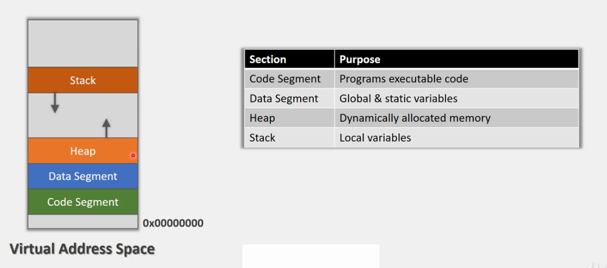
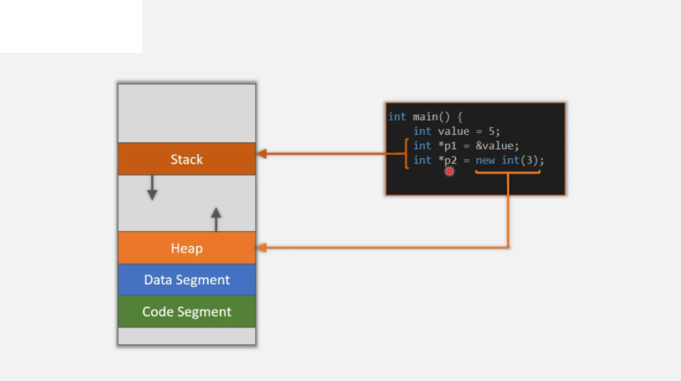
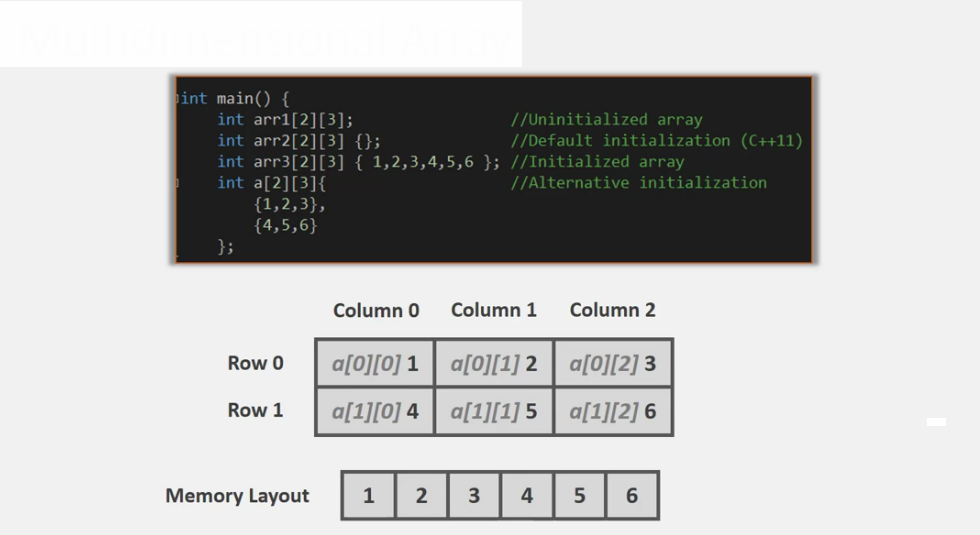
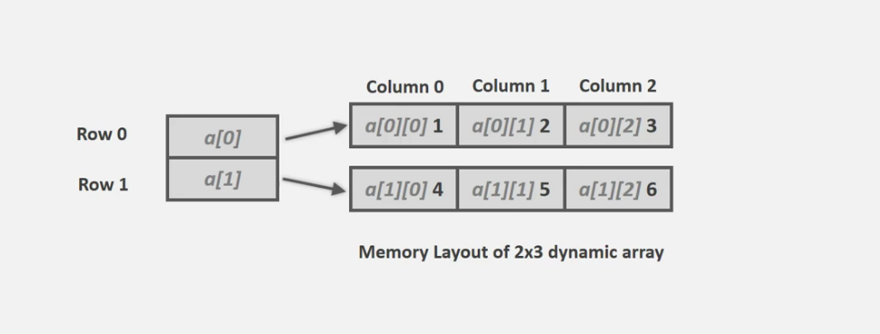

#C++ Introduction to Pointers

Pointers is what separates C/C++ from other languages. These 
are incredibly powerful as they allow programs to access 
memory directly and manipulate it.

* pointers & its applications 
* pointers to arrays & heap based arrays 
* advance memory management 

###Process
* When a program is started, a process is created
* Virtual address space that provides an enviroment to for the executable to run 
* Size depends on the platform 
* Some parts of the process are storing data 
    * global, static, local & runtime
    

###Pointer 
* A pointer is like an address type variable, it holds an address instead of a data value
* Systax is different than a variable 
    *   int *p [ &\<variable> | dinamyc_memory ]
    
A pointer can hold adress of :
* variable 
* pointer
* object
* function 

###Pointer Applications 
1. Avoid copy 
2. Manipulate data indirectly 
3. Hardware access
4. Callbacks ( invoke )
5. Dynamic arryas
6. String 
7. Other data structures, that without pointer, it would be imposible to implement them

##Static Arrays 
- Fixed-size collection of elements of same type 
- Size is fixed at compile time & cannnot grow 
    - except in C99
- The elements are stored sequentially & contiguously
- Each element has its own location 
    - access through its positions
    - has 0 based index 
- Allows a collective name for a group of elements 
    - useful for large data sets

###Array as Function Argument
- C/C++ arrays do not store size
- Passing arrays to functions requires size to be passed as well
- No automatic bounds checking 
    - underflow / overflow
- Alternative, use std::array 
    - intruduced in c++11
    - safer and easier to use

###Array as a Reference Argument
- You can create a reference to an array and access to its elements by its reference
    - int (&ref)[5] = arra;  
- Safe way to pass ans array to a function 
- Size is passed automatically to the function by the compiler
- It is implemented using templates
- E. g. 
    - \<typename T, int size> std::begin(T(&ref)[size])
    - \<typename T, int size> std::end(T(&ref)[size])
 
###STL array container
- Performance is the same as static array 
- It includes build in function 
    - std::array\<int, size> arr;
    - int arr_size = arr.size();
    
###Arrays on Heap
- Arrays that are stored in the Heap instead of the Stack 
    - int *p = new int[5];

##Multidimensional Arrays 
- a multidimensional array is an array of arrays
- the data can be represented in a tabular form 
- N-dimensional array can be declared as 
    - \<type> \<array_name> [size1][size2]...[sizeN]
    - total number of elements : size1 * size2 * sizeN
- the array elements are stored contiguosly in memory 
 
    

###Multidimensiona Arrays on Heap
- Can be created on the heap, we used it when we don not know the array size at compilation time
- Memory allocation happens on runtime
- Implemented as array of arrays 
- Has to be allocated in multiple steps 
- E.g. in a 2D array
    - each row is allocated as a separated 1D array 
    - the pointers are stored in another 1D array (array of pointers)
    - the type of 2D array will be a pointer to a pointer

 
 
##Dynamic array
- You dont have to deal with memory allocation and dellocation manually 
